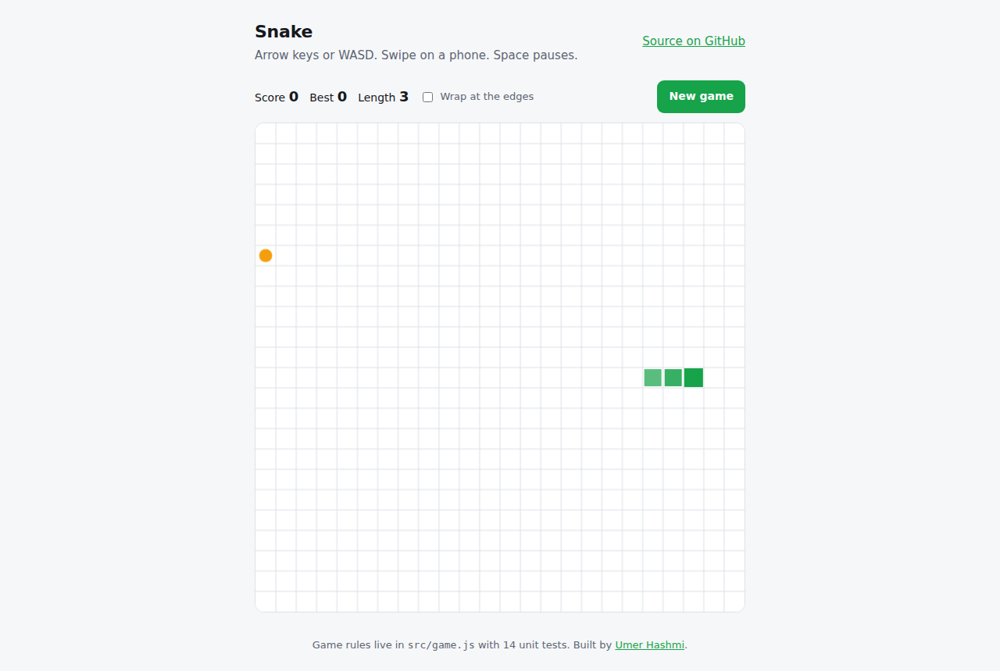

# Snake

[](https://github.com/umer-78/snake-game/actions/workflows/ci.yml)


**Play:** https://umer-78.github.io/snake-game/

Snake on a canvas, with the rules separated from the rendering so they can be
tested. No framework, no build step, no dependencies.



- Arrow keys or WASD, swipe on a phone, on-screen pad on touch devices
- Space starts, pauses and resumes; the game also pauses when the tab loses focus
- Optional **wrap mode**: leave one edge, come back on the other
- Speeds up as you score, to a floor that stays playable
- High score saved locally — and the game still works when storage is blocked
- Light and dark theme

## The interesting part

`src/game.js` has no DOM in it, so the rules can be unit tested:

```js
import { Game } from './src/game.js';

const game = new Game({ width: 20, height: 20, seed: 42 });
game.turn('down');
game.step();
console.log(game.toString());
// ....*......
// ..@........
// ..o........
```

Three rules that are easy to get wrong, and are covered by tests:

1. **The tail cell is free.** Moving onto the square your tail is about to leave
   is legal — a naive collision check ends the game instead.
2. **Queued turns.** Two quick presses in one frame both count, so a fast
   double-turn does not get swallowed.
3. **Food placement picks from the free cells**, rather than guessing at random
   until it misses the snake, which slows to a crawl on a nearly full board.

## Run it

```bash
git clone https://github.com/umer-78/snake-game.git
cd snake-game
node --test          # 14 unit tests
python3 -m http.server 8080
# open http://localhost:8080
```

ES modules need to be served over HTTP; opening the file directly will not work.

## License

[MIT](LICENSE)
